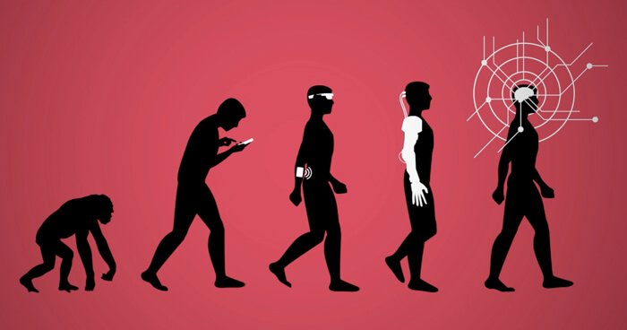

## CURRENT INTERESTS

I feel that the mission of the world of software engineering is like the adage, “work smarter, not harder,” which I know a lot of coders practice and commit to since most of us are lazy anyway. However, there definitely is a lot of work put into software engineering, and this is to help with the advancement and development of programs so that the rest of the world can work smarter, not harder. Computer science is necessary for our current society. Although it is not a particular career goal of mine, I desire to learn what I can to improve any skills to become better in the field of software engineering. 

## WHAT KEEPS ME GOING

The best part of this field is running a program *and* have it actually work. I swear, the hours accumulated that I stared at a code trying to understand why it does not work will probably last longer than any amount I sleep daily. Jokes aside, the rewarding satisfaction that comes from understanding a problem, outlining the algorithm for it, writing out hard code, and then pressing the “Run” button and see that it passes is one of the best feelings of satisfaction. 

## FUTURE INTERESTS 

Frankly speaking, I hope to learn how to code faster and better. I want to be able to take a problem and effectively solve that through software engineering or some other type of hard skill. I would also like to learn more languages. I have little experience with C++ and RStudio, so these are two that I want to become a more fluent in. I know that RStudio is used a lot for data analysis and statistical computation, which I am a little more interested in as a public health major. Therefore, with these types of skills, I hope to get experience working with real public health data. 

Computer science is not a stagnant field. It will continue to evolve, and I want to be a part of the change.
