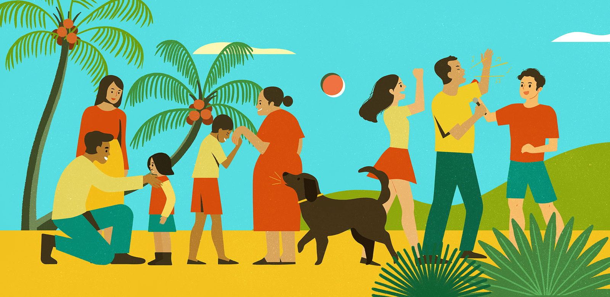

## FORMING A NEW PERSPECTIVE

One of the most interesting courses I took at UH Manoa is “Philippine Food & Pop Culture.” It might have been the most educationally enriching course I have ever taken. I am not Filipino, but I learned so much about the history and diversity of this culture that it has completely changed my perspective on it. I encourage everyone to take that class if they have not already.

For this class, one of the concepts that I learned is that relationships, dynamics, and issues (such as racism, warfare, etc.) throughout history play a significant role in how countries, people, and things develop and interact in current societies. The colonization of the Philippines has created a warped sense of identity within its citizens and continued racism even within its subgroups of people. 

## BACKGROUND INFO FOR THE PROJECT

In 2020, there were global Twitter fights between the Philippines and South Korea, spreading the hashtags, “#CancelKorea” and “#SorryToFilipinos.” One mistake of a Filipina individual on social media leads to some Koreans to attack and insult a whole nation of people. 

## MESSAGE OF THE VIDEO

I wanted to create a video addressing this topic to analyze the underlying racism and hierarchy created in people’s heads. Citizens from higher-income countries are quick to judge those from lower-income countries, but I think we all forget sometimes how that came to be in the first place. The message of the video project is to share that we should be less judgmental towards others, more aware of how socio-economic issues affects a community, and learn our history to develop a more well-rounded mindset and understanding of other cultures. 

To encompass everything I learned, I end the video hoping to spread a new hashtag: #LoveToFilipinos

## WHAT I LEARNED

Other than building more experience creating video projects, I have learned that opening your mind to different perspectives exercises your brain to think outside of the box. It is easy to become one-tracked, but sometimes, there can be multiple ways to view a problem. Thus, there can be multiple solutions. We just haven’t found all of them yet.

Links to [Part 1](https://youtu.be/nBzvuZrBnn8) and [Part 2](https://youtu.be/ZgU2NVyOftc) of the video!
