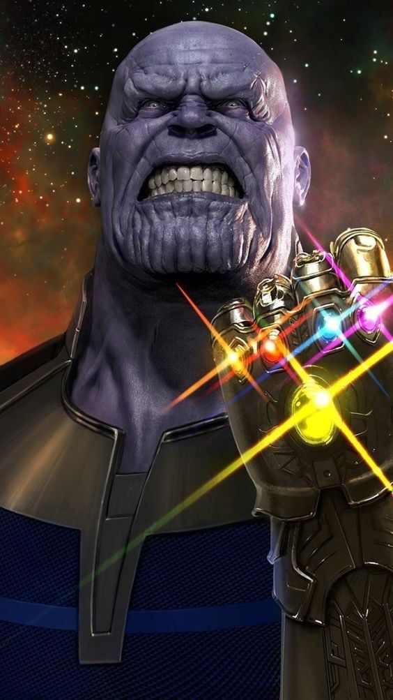

  

STORY BACKGROUND OF THE GAME

In the Marvel Universe, the Avengers come together to fight the evil villain Thanos from taking over the world. However, in an unexpected turn of events, we are helping Thanos fend off heroes Thor, Captain America, and Iron Man. Thanos is powerful, but he’s not omnipotent. Three hits from any of them will finish him. Help maneuver Thanos so he will be able to succeed. 

PROCESS

I was exposed to the world of computer science and coding in my first year of college. It was difficult, and I worked hard to understand and use Java. In my first ICS course, my groupmates and I worked together to code a game that would be fun and up-to-date with pop culture. The Avengers series was coming to an end and was probably at its peak of popularity. We chose to use that as our creative background for the game we made. 

We brainstormed ideas on what we might do and decided to make multiple classes in our game to have it inherit other subclasses. We split the work as evenly as we could. I created the function of Captain America falling from the top of the screen, helped to assign “lives” to Thanos, added in all the visual and audio elements, and since I was the last to look over it, I helped to check and edit. 

Overall, we combined what we learned from class about polymorphism, functions, and inheritance to write our code in Java using the Eclipse app. The objective of the game is written out more creatively in the “Story Background of the Game” above, but technically, it was just to use the “w,” “a,” “s,” “d” keys to maneuver the icon (Thanos) up, left, down, right, respectively, throughout the game to avoid touching the moving figures (Thor, Captain America, and Iron Man). The player only gets three tries before the game ends. 

WHAT I LEARNED

As simple as we thought the concept was, it proved to be more difficult than expected as we were all new coders. This pushed my limits of what I thought I could do, and I learned that hard work can conduct change, but collaboration on projects like these can have pros and cons. It could not have been finished without all of us. It was one of the most stressful things I had to do, but it was so rewarding when we finally got everything ready to run, and we could finally play it.

This is the link to a run-through of our game: https://youtu.be/K8GA4yFBqSA.

